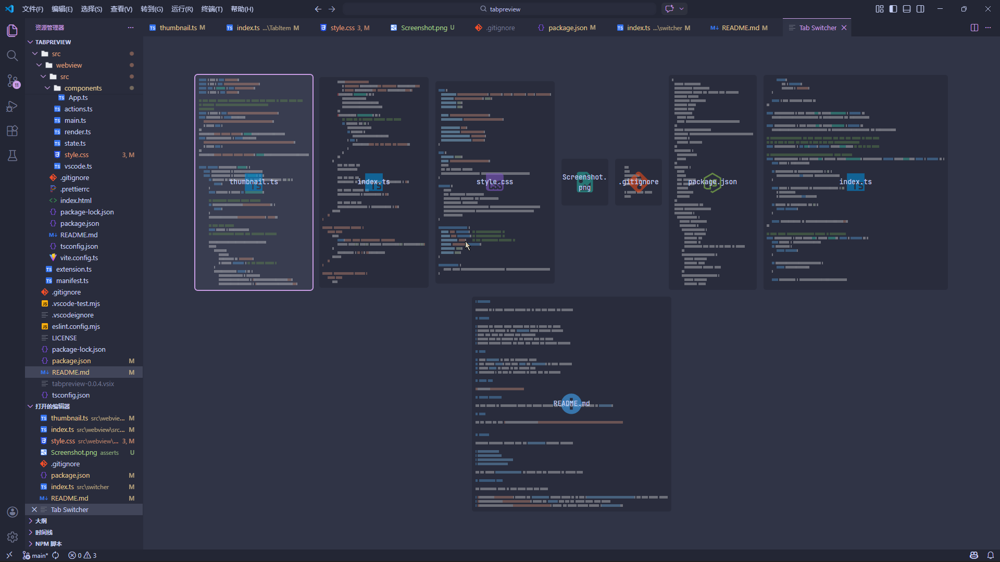

# TabPreview

TabPreview is a custom Ctrl+Tab switcher for VS Code with visual tab previews.

## Features

- Replaces the default editor switcher flow with a visual tab panel.
- Overrides the built-in VS Code `Ctrl+Tab` editor switching shortcut.
- Shows file icons and optional code thumbnails.
- Supports quick tab switching and tab closing from the panel.
- Provides extension settings for size, icon style, and thumbnail rendering.

## Usage

1. Press `Ctrl+Tab` to open the TabPreview panel.
2. Keep holding `Ctrl`, then press `Tab` (or `Shift+Tab`) to cycle selection.
3. Release `Ctrl` to switch to the selected tab.
4. Middle-click a tab item in TabPreview to close that tab directly.

## Screen Shot

## Command Visibility

The main command is intentionally hidden from Command Palette, the only way to open tab preview is `Ctrl+Tab`.

## Icons

All tab icons are from [vscode-material-icon-theme](https://github.com/material-extensions/vscode-material-icon-theme)

## Settings

TabPreview contributes settings under the `tabPreview.*` namespace, including:

- `tabPreview.retainWebview`
- `tabPreview.size`
- `tabPreview.icon.*`
- `tabPreview.showCloseButton`
- `tabPreview.thumbnail.*`

Use the command `tabpreview.settings` to quickly open the TabPreview UI settings page.

## Configuration Files

The configuration system is split across these four files:

- [package.json](package.json): Declares all `tabPreview.*` settings exposed to VS Code (`contributes.configuration.properties`) and their default values.
- [src/shared/types.ts](src/shared/types.ts): Defines the `Config` type and all related config value unions.
- [src/shared/defaultConfig.ts](src/shared/defaultConfig.ts): Defines the runtime baseline defaults (`defaultConfig`).
- [src/config/index.ts](src/config/index.ts): Loads user/workspace settings from VS Code and merges with `defaultConfig` via `getConfig()`.

## Known Limitations

- Thumbnail rendering depends on available text document content in memory.
- Some non-file tabs (for example certain webview/terminal tabs) may use fallback identifiers.

## Development

- Build extension: `npm run compile`
- Build webview: `npm run webview:build`
- Watch mode: `npm run watch` and `npm run webview:watch`

## Build And Checks

- `npm run compile`: TypeScript compile + type checking.
- `npm run lint`: ESLint checks for source files.
- `npm run pretest`: Runs compile and lint together.
- `npm test`: Runs extension tests.

Config consistency checks are included in [src/test/extension.test.ts](src/test/extension.test.ts):

- Confirms `getConfig()` matches `defaultConfig` when no custom settings are provided.
- Confirms every mapped `tabPreview.*` key exists in `package.json` and its default value matches `defaultConfig`.

## License

MIT

## MISC

This extension is published manually, by run `npm run package` and upload the vsix file to [vscode marketplace](https://marketplace.visualstudio.com/vscode)
